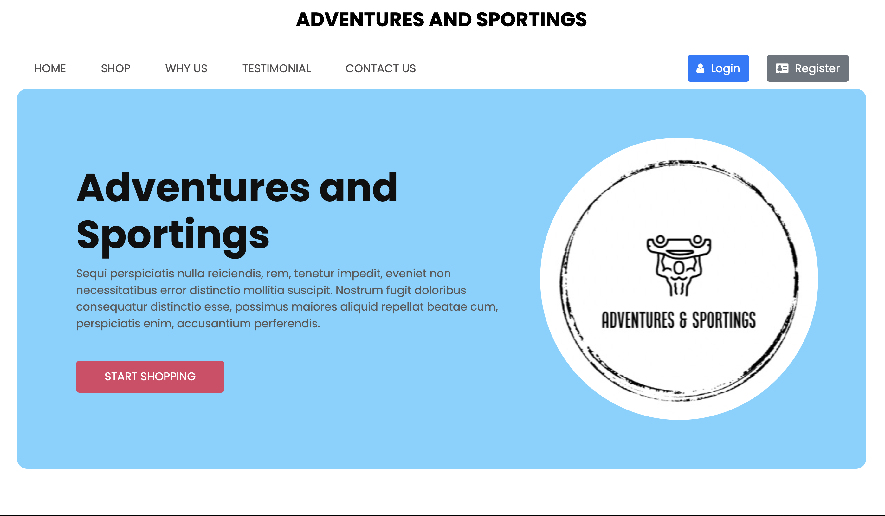

# Adventures and Sportings

## cit480-project

CIT480 E-commerce project

## Project Overview

**Adventures and Sportings** is a site dedicated to fitness equipment and accessories. Our goal is to make it easier for fitness enthusiasts to find the products they need. Whether you're a runner, swimmer, boxer, or powerlifter, you can find everything you’re looking for on our site.

## Technology Stack

We are building this project using the **LAMP stack**:

-   **Linux**
-   **Apache**
-   **MySQL**
-   **PHP**

On the frontend, we are using:

-   **HTML**
-   **CSS**
-   **JavaScript**
-   **Laravel's Blade Templates**

## Tools and Software

To manage our workflow and development process, we are leveraging several software tools:

-   **Notion**: To track our backlog and tasks.
-   **LucidChart**: For mapping out our architecture and database structures.
-   **Figma**: For creating wireframes and visual design mockups.
-   **Google Docs**: To manage and store our technical documentation.

---
